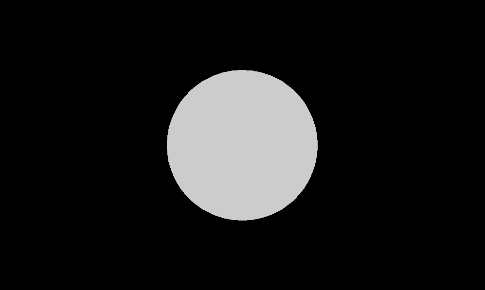

# 手把手教你实现 360° 全景图预览插件

## 原理

- 利用 `ThreeJS` 在 `canvas` 中画一个球体，将全景图作为球体的纹理填充，然后把相机 `camera` 置于坐标系原点即可看到全景图的渲染。
- 鼠标拖动修改 `camera` 的朝向，改变视野
- 利用 HTML 生成标签内容，通过屏幕坐标点和空间坐标的转换规则，保存标签位置，使得标记位置能够始终正确。

## 基础知识

### 平面坐标点

求圆上一点的坐标。


### 空间坐标点

高中数学知识，求球体表面一个点的空间坐标 `(x, y, z)` ，模型如下（`ThreeJS` 中坐标系 X 轴是朝右的，这里之所按这种方向建立坐标系，是因为实现过程中把 X 轴翻转了）：


_图是用 [drawio](https://www.diagrams.net/) 画的_

## 实现过程

以下每一步你都可以停下来自己去思考实现。

### 1. 定义用法

```js
new Viewer({
  container: "#demo",
  img: "./test.png"
})
```

基本代码结构如下：

```js
class PanoramasViewer {
  constructor(option) {
    this.option = option;

    this.render()
  }

  render(){
    console.log('rendered.')
  }
}
```

### 2. ThreeJS 渲染一个球体

这里你需要去学习一下 `three.js` 的基础知识(`scene`、`camera`、`renderer`)。

#### 2.1 创建球体

只后你大概可以像这样创建一个球体：

```js
const {
  SphereGeometry,
  MeshBasicMaterial,
  Mesh,
} = THREE;
_createBall() {
    // 创建一个球体，(半径，水平分段数，垂直分段数)
    const geometry = new SphereGeometry(1000, 100, 100);
    const material = new MeshBasicMaterial({color: 0x645d50});
    const mesh = new Mesh(geometry, material);
    return mesh;
  }
```

#### 2.2 渲染球体

把这个球体渲染出来，这里我们创建的球体半径是 1000，现在把相机位置定位于 Z 轴 2000 位置处观察。

```js
render(){
  this._scene = new Scene();
  this._scene.add(this._createBall());

  this._camera = new PerspectiveCamera(75,this.width / this.height,0.1,1100);
  this._camera.position.set(0, 0, 2000);
  this._camera.lookAt(new Vector3(0, 0, 0));

  this._renderer = new WebGLRenderer();
  this._renderer.setSize(this.width, this.height);
  this._container.appendChild(this._renderer.domElement);
  this._renderer.render(this._scene, this._camera);
  console.log('rendered.')
}
```

现在你看到的效果应该是这样：




#### 2.3 添加坐标轴观察

这一步也可以直接跳过。

由于没有加光照效果，所以这个球体看不出任何立体效果。现在我们调整一下镜头最远焦距和相机的位置，把坐标轴显示出来，方便理解。

```js
  render() {
    // ...
    
    this._addAxes(); // (*)
    this._camera = new PerspectiveCamera(75, this.width / this.height, 0.1, 1500); // (*)
    this._camera.position.set(1100, 1100, 1100); // (*)

    // ...
  }

  _addAxes() {
    const axesHelper = new THREE.AxesHelper(3000);
    this._scene.add(axesHelper);
  }
```

现在看到的效果如图所示：


### 3. 渲染图片

#### 3.1 球体添加纹理

现在创建的球体是纯色纹理，通过 Three.js `MeshBasicMaterial` 方法的学习，可以知道参数有一个选项是 `map` 它接受一个 `Texture` 类型的值作为颜色贴图。

当前使用的 `three.js` 版本为 `r119`，加载图片资源需使用 `new THREE.TextureLoader().load` 方法，具体代码如下：

```js
_createBall() {
  const texture = new TextureLoader().load(this.option.img);
  const geometry = new SphereGeometry(1000, 100, 100);
  const material = new MeshBasicMaterial({ map: texture });
  const mesh = new Mesh(geometry, material);
  return mesh;
}
```

按照这种方法，我们刷新页面，发现之前的球体变成了黑色，似乎没有渲染出来。


这是由于 `_createBall` 方法中的 `new TextureLoader().load()` 是异步加载资源，按照当前的写法图片还没有加载完成，就执行了后续操作。我们修改 `.load` 为回调函数的用法，用 Promise 封装，对应的 `render` 函数也需要改成 `async function`，如下：

```js
async render() {
  this._scene = new Scene();
  const mesh = await this._createBall();
  this._scene.add(mesh);
  // ...
}
_createBall() {
  const loader = new TextureLoader();
  return new Promise(resolve => {
    loader.load(this.option.img, (texture) => {
      const geometry = new SphereGeometry(1000, 100, 100);
      const material = new MeshBasicMaterial({ map: texture });
      const mesh = new Mesh(geometry, material);
      resolve(mesh);
    });
  }).then(res => res);
}
```

Great ! 看起来舒服了。


_说明：用回调函数的形式先等待图片资源加载完成虽然实现了，但图片多了、大了会造成等待，虽然加个 Loading 初始化状态也不是什么大问题，但完全可以让其它代码先跑着。_


#### 3.2 修改相机位置

现在我们是在球体的外部观察整个球体，让我们把相机位置移到坐标系原点 `(0, 0, 0)`（为什么是原点？因为创建的球体没有指定坐标，默认就是从原点创建）。

```js
render() {
  // ...
  this._camera.position.set(0, 0, 0); // (*)
  // ...
}
```

现在刷新页面，可以看到一片漆黑，好像有点慌了。

不要慌，因为 Three.js 中 [Material](https://threejs.org/docs/#api/zh/materials/Material.side) 默认渲染正面，我们可以修改 `side` 的值为 `BackSide` 或 `DoubleSide` 来渲染背面。

```js
_createBall() {
  // 双面纹理
  const material = new MeshBasicMaterial({ map: texture, side: THREE.DoubleSide });
}
```

现在可以看到这样的效果了：


等等，好像哪里不对？这个渲染出来的图和原图是反方向啊！

#### 3.3 修正渲染方向

`Mesh` 有一个 `scale` 属性来对坐标进行缩放，我们设置 `scale.x = -1` 来翻转 X 轴的渲染。 

```js
_createBall() {
  const loader = new TextureLoader();
  return new Promise(resolve => {
    loader.load(this.option.img, (texture) => {
      const geometry = new SphereGeometry(1000, 100, 100);
      const material = new MeshBasicMaterial({ map: texture, side: THREE.DoubleSide });
      const mesh = new Mesh(geometry, material);
      mesh.scale.x = -1; // (*)
      resolve(mesh);
    });
  }).then(res => res);
}
```

现在内部的渲染方向符合预期，其实这个时候球体外部渲染是反方向的。


### 4. 动起来

现在这个球体只是一次性渲染，为了让它动起来，我们需要增加持续渲染事件，我们用 `requestAnimationFrame` 来修改渲染函数。

```js
async render() {
  // ...
  this.draw()
}

draw(){
  requestAnimationFrame(() => {
    this.draw();
  });
  this._renderer.render(this._scene, this._camera);
}
```

#### 4.1 自旋转

有了前面的基础，我们如何让这个画面旋转起来呢？答案就是每次 `draw` 的时候修改相机的 `lookAt(x, y, z)` 坐标。

我们让视野水平旋转，这是一个数学知识，见[基础知识](#基础知识)，球体的半径固定，`y = 0` ，改变角度时求 `x` 和 `z` 的值。这里我们暂定每秒旋转 `3º` (即每帧旋转 `0.05º`)，当前相机默认观察 `(0, 0, 0)` ，这等效于看向 Z 轴的负方向。

```js
constructor(option){
  this.rotate = 0;
}

_computeLookAt(){
  // 这里需要把角度转化为弧度再计算 radian = (2π / 360) * degreee
  const x = this.r * Math.sin(THREE.MathUtils.degToRad(this.rotateX));
  const z = -this.r * Math.cos(THREE.MathUtils.degToRad(this.rotateX));
  this._camera.lookAt(x, 0 , z);
}

draw(){
  requestAnimationFrame(() => {
    this.draw();
  });

  this.rotate += 0.05;
  this._computeLookAt();
  this._renderer.render(this._scene, this._camera);
}
```


#### 4.2 鼠标拖拽

接下来我们实现鼠标拖拽改变视野的功能，有了上面自旋功能，我们可以很容易知道这里的实现只需要把鼠标移动的距离和旋转的角度结合起来就行了。

我们需要实现：

- 水平方向拖动
- 垂直方向拖动

首先我们需要确定，距离和角度应该是怎样的关系，比如鼠标移动了 `100px` ，那么角度算是旋转了多少度呢？这个其实随便定一个就行，假设你需要让鼠标更加灵敏，那设置为 `100px` 对应 `360º` 也行。这里我们简单粗暴认为 `100px = 10º`。

先搭起基本架子：

```js
constructor(option) {
  this.setup()
}

setup() {
  this.render();
  this.bindEvents();
}

onMouseDown(e){
  this.startX = e.clientX;
  this.startY = e.clientY;
  this.moving = true;
  // 上一次旋转的角度
  this.lastRotate = this.rotate;
}
onMouseMove(e){
  if(this.moving){
    const deltaX = e.clientX - this.startX;
    const deltaY = e.clientY - this.startY;

    // 用 + 还是用 - 取决于你希望图片移动的方向和鼠标方向是否一致
    this.rotate = this.lastRotate - deltaX * 0.1; // 0.1 为约定的像素和角度比例系数
  }
}
onMouseUp(e){
  this.moving = false;
}

bindEvents() {
  this._container.addEventListener("mousedown", this.onMouseDown.bind(this));
  this._container.addEventListener("mousemove", this.onMouseMove.bind(this));
  this._container.addEventListener("mouseup", this.onMouseUp.bind(this));
}
```

就这么简单，你就实现了水平方向的拖动。垂直方向的旋转也是同样的道理，我们把 `rotate` 改成 `rotateX`，增加一段同样的逻辑处理一个叫做 `rotateY`（垂直旋转角度）的字段。如下：

```js
constructor(option){
  this.rotateX = 0;
  this.rotateY = 0;
}
onMouseDown(e){
  this.startX = e.clientX;
  this.startY = e.clientY;
  this.moving = true;
  // 上一次旋转的角度
  this.lastRotateX = this.rotateX;
  this.lastRotateY = this.rotateY;
}
onMouseMove(e){
  if(this.moving){
    const deltaX = e.clientX - this.startX;
    const deltaY = e.clientY - this.startY;

    // 用 + 还是用 - 取决于你希望图片移动的方向和鼠标方向是否一致
    this.rotateX = this.lastRotateX - deltaX * 0.1; // 0.1 为约定的像素和角度比例系数
    this.rotateY = this.lastRotateY - deltaY * 0.1;
  }
}
draw() {
  this.rotateX += 0.05;
  this.rotateY += 0.05;
}
```

现在垂直方向仍然不生效，因为在 `_computeLookAt` 函数中我们把 Y 轴坐标写固定为 `0` 了，这里知道水平角度和垂直角度，求点的空间坐标，见[空间坐标点](#基础知识)部分。现在修改代码如下：

```js
_computeLookAt() {
  let x, y, z;

  // 角度转弧度 radian = (2π / 360) * degreee
  const radianY = THREE.MathUtils.degToRad(this.rotateX);
  const radianX = THREE.MathUtils.degToRad(this.rotateY);
  x = this.r * Math.cos(radianY) * Math.cos(radianX);
  y = this.r * Math.sin(radianY);
  z = this.r * Math.cos(radianY) * Math.sin(radianX);
  this._camera.lookAt(x, y, z);
}
```


如图，已经实现了鼠标的拖拽效果，但是有一个问题，垂直拉到 90 度以后，会翻转到另一侧，这不符合预期，我们需要限制一下垂直方向视野的角度，大概设置为 `±85º` 即可。

```js
_computeLookAt() {
  let x, y, z;

  // 纬度方向旋转不能超过正负 85 度角（即接近南北极附近）
  this.rotateY = Math.max(-85, Math.min(85, this.rotateY));

  // 角度转弧度 radian = (2π / 360) * degreee
  const radianY = THREE.MathUtils.degToRad(this.rotateX);
  const radianX = THREE.MathUtils.degToRad(this.rotateY);
  x = this.r * Math.cos(radianY) * Math.cos(radianX);
  y = this.r * Math.sin(radianY);
  z = this.r * Math.cos(radianY) * Math.sin(radianX);
  this._camera.lookAt(x, y, z);
}
```

在球体上我们通常用 `longtitude` 和 `latitude` 即经纬度来表示点的坐标，所以你现在可以把代码中的 `rotateX` 和 `rotateY` 分别改成 `lon` 和 `lat` 了，当然也可以不用修改，这里我就不改了。

至此，已经完成了全景图的预览。

### 5. 全景标记


## 后序

江湖再见。
